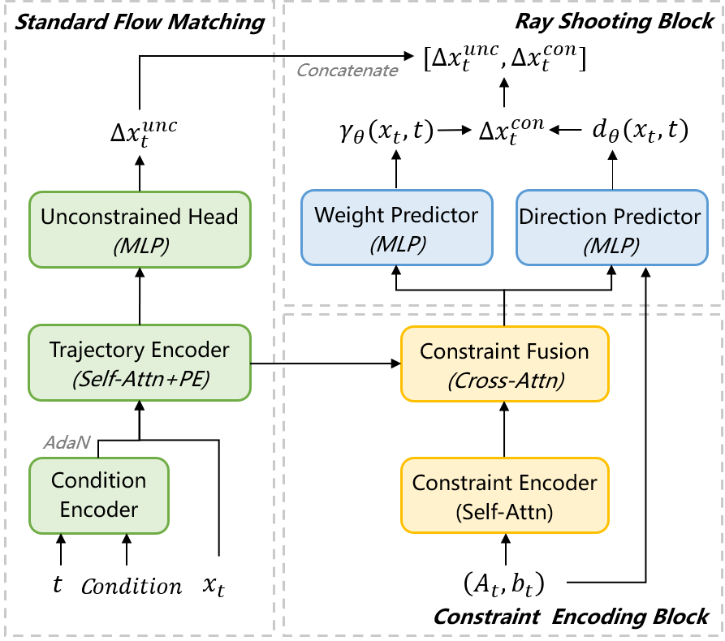

# PolyFlow: Safety Guaranteed and Sample Efficient Flow Matching via Constraint Embedding and Projection-free Update

This repository contains the official implementation of the paper **"PolyFlow: Safety Guaranteed and Sample Efficient Flow Matching via Constraint Embedding and Projection-free Update"** (Under Review for ICML 2026).

## 📄 Abstract

While flow-based generative models have achieved remarkable success in virtual domains, deploying them in safety-critical physical environments remains a fundamental challenge due to strict constraint requirements. Existing post-hoc safety correction methods are computationally expensive and often distort the learned distribution.

We propose **PolyFlow**, a framework that guarantees strict satisfaction of arbitrary polyhedral constraints by embedding them directly into the flow dynamics and model architecture. PolyFlow introduces a discrete-time flow formulation and a projection-free architecture, which eliminate numerical integration errors and guarantee the safety of generated trajectories without the need for expensive iterative solvers. Experimental results demonstrate that PolyFlow achieves zero constraint violation and superior distribution fidelity across various planning and control tasks, while significantly reducing inference latency compared to state-of-the-art constrained generation baselines.

## 🏗️ Framework

PolyFlow ensures safety through a novel design philosophy: embedding constraints directly into the flow definition and model architecture rather than treating them as an afterthought.

<p align="center">

</p>

<p align="center">

</p>

The framework consists of two core components:

1. **Discrete-Time Flow Formulation:** We reformulate flow matching in a discrete-time setting. We prove that the interior safety of conditional flows guarantees the safety of the marginal flow, thereby eliminating numerical integration errors as a source of constraint violation .


2. **Projection-Free Architecture:** We utilize a parameterization inspired by the Frank-Wolfe algorithm and ray-shooting techniques. The model learns a continuous direction field and projects it onto the safety set boundary using a differentiable Ray Shooting (RS) operator, combined with a learnable gating factor to ensure every update step resides within the feasible set .


## 🛠️ Installation

The project requires **Python 3.10**. We recommend creating a dedicated Conda environment.

1. Create and activate the environment:
```bash
conda create -n polyflow python=3.10
conda activate polyflow

```


2. Install dependencies:
```bash
pip install -r requirements.txt

```


## 🚀 Usage

The codebase is organized into branches for different task domains.

###  Switch to Locomotion Branch

For locomotion tasks (Hopper, Walker2d, HalfCheetah), please switch to the `locomotion` branch:

```bash
git switch locomotion

```

#### 1. Training

To train the PolyFlow model, use the `train_polyflow.py` script with the appropriate configuration file.

```bash
python train_polyflow.py --config-name=train_polyflow_xxxxxx.yaml

```

**Task Configurations:**
Replace `xxxxxx` in the command above with the specific task identifier:

| Identifier | Task Description | Constraints |
| --- | --- | --- |
| `hoppercpx_fixcons` | **Hopper-Simple** | Dynamic torso height constraint |
| `hoppercpx2_fixcons` | **Hopper-Complex** | Composite constraints (height, velocity bounds) |
| `walkercpx_fixcons` | **Walker2d-Simple** | Dynamic torso height constraint |
| `walkercpx2_fixcons` | **Walker2d-Complex** | Composite constraints (height, velocity bounds) |
| `halfcheetah` | **HalfCheetah** | Composite action constraints |

Training results and checkpoints will be saved in the `outputs/` directory.

#### 2. Sampling / Rollout

To evaluate a trained model and generate trajectories, use the `sample_polyflow.py` script:

```bash
python sample_polyflow.py --config-name=time_polyflow_xxxxxx.yaml eval.load_model_path=/path/to/your/checkpoint

```

* Replace `xxxxxx` with the task identifier used during training.
* Replace `/path/to/your/checkpoint` with the actual path to your saved model (e.g., inside `outputs/`).


### Switch to Maze Branch

For the maze2d task, please switch to the `maze` branch:

```bash
git switch maze
```

The training and sampling commands are:

```bash
python train.py --config-name=train_oneray_maze2d.yaml
```

```bash
python sample.py --config-name=sample_oneray_maze2d.yaml
```


## Acknowledgements

This codebase includes components adapted from the following open-source projects:

* [Diffuser](https://github.com/jannerm/diffuser)
* [SafeDiffuser](https://github.com/Weixy21/SafeDiffuser)

<!-- ## 🖊️ Citation

If you find this work useful in your research, please consider citing:

```bibtex
@article{polyflow2026,
  title={PolyFlow: Safety Guaranteed and Sample Efficient Flow Matching via Constraint Embedding and Projection-free Update},
  author={Anonymous Authors},
  journal={Under Review at ICML},
  year={2026}
}

``` -->